AHB 总线
==========
AHB（ Advanced High-performance Bus）总线在 AMBA2 中就已定义，最初是作为系统高速总线使用，适用于高性能，低功耗的系统设计。
由于 AXI 总线作为高速总线的优势更加明显，AHB 会用在相对低速的系统设计中。

AHB 支持多 master，多 slave 的互联模式。但是随着系统的发展，AHB 更多用于支持简单的数据传输，后来对 AHB 协议做了简化设计，
定义了 AHB-Lite 协议，主要用在单 master 数据访问中，不需要支持 split 与 retry。

.. note:: 
    目前AHB协议多用在低性能需求的M型处理器中，也多用在片上memory或者一些低带宽需求定位外设接口设计。

总线特点：
    - 支持突发（burst）传输
    - 支持 split 传输
    - 单周期 master 交接控制权

AHB 版本
-----------

=====  ========  ===============================================================================================================================
版本     协议                                                               应用场景
=====  ========  ===============================================================================================================================
AMBA2  AHB       - 高带宽与高性能场景；
                 - 多对多传输;
                 - 通过 arbiter 和 decoder 实现通路选择
AMBA3  AHB-Lite  - 应用在高性能场景；
                 - 一对多传输；
                 - 通过 decoder 实现通路选择；
                 - 支持 memory 类型访问
AMBA5  AHB-Lite  - 应用于高性能场景；
                 - 一对多传输；
                 - 通过 decoder 实现通路选择；
                 - 支持 memory 类型访问；
                 - 支持外部 memory 类型访问；
                 - 支持安全保护；
                 - 支持大小端转换
=====  ========  ===============================================================================================================================

总线结构
------------------
AHB 协议支持多 master，多 slave 的结构设计，因此需要有 Arbiter 与 Decoder 实现
请求与响应的仲裁与编解码映射。

Master 首先向仲裁器发送发文请求，仲裁器决定让符号的 master 获取总线访问的权限，master 获取权
限并将数据与控制信号发送到仲裁器，仲裁器通过地址解析选择对应 slave 通路，然后将请求发送到
对应端。同样响应的数据会通过 Decoder 解析，并返回给对应的 master。

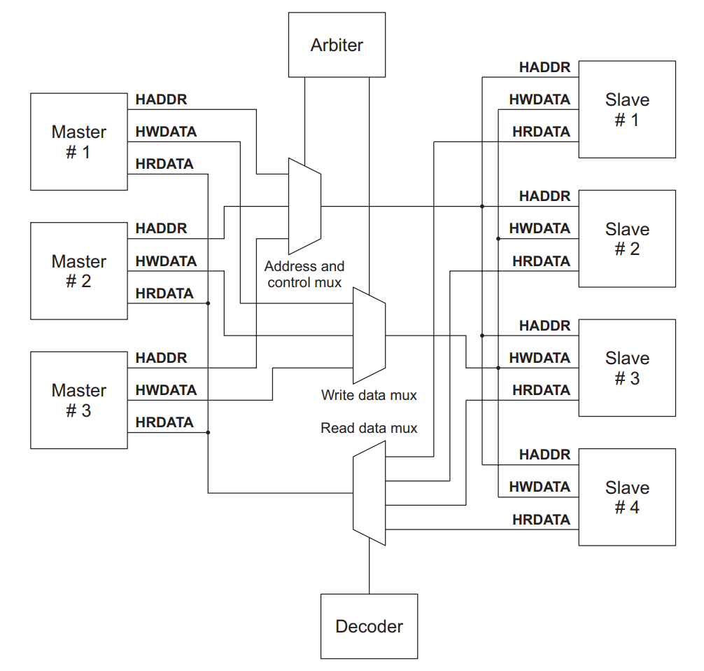

这种多路复用的机制能够实现多对多的访问。但是一次只能有一对 maste 与 slave 通信，
无法实现多对多的同时通信，对于带宽需求比较大或者实时性要求较高的系统不太适合。

AHB 接口
-----------------

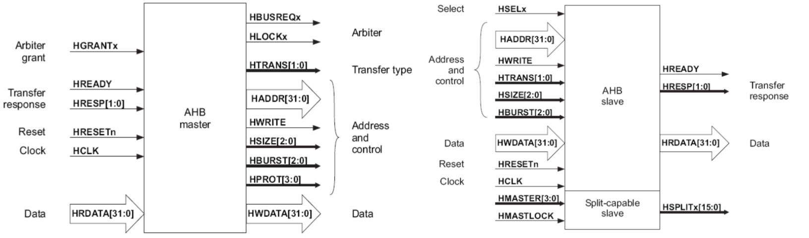

============  =======  =============  ==================================================================
   信号名       源         目的                                      功能
============  =======  =============  ==================================================================
HCLK          clock    ahb模块        系统时钟，上升沿采样
HRESETn       reset    ahb模块        系统复位，低电平有效
HADDR[31:0]   master   decoder/slave  访问地址
HTRANS[1:0]   master   slave          当前传输类型，可选NONSEQUENTIAL/SEQUENTIAL/IDLE/BUSY
HWRITE        master   slave          读/写访问，1是写，0是读
HSIZE[2:0]    master   slave          transfer的位宽，一般是字节（8-bit），半字（160-bit），字（32-bit）
HBURST[2:0]   master   slave          突发方式，数量（4/8/16）+类型（incrementing/wrapping）
HPROT[3:0]    master   slave          数据保护，表明当前数据的访问权限
HWDATA[31:0]  master   slave          写入数据
HSELx         decoder  slave          slave选择使能，由地址译码驱动
HRDATA[31:0]  slave    master         读出数据
HREADY        slave    master         传输信号，为1表明传输结束，为0表明传输进行
HRESP         slave    master         回应信号，表明slave的接收状态，可选OKAY/ERROR/RETRY/SPLIT
============  =======  =============  ==================================================================

工作过程
-------------

基本方式
^^^^^^^^^^^^
传输有两阶段组成：地址阶段，数据阶段。

每个阶段最段持续一个周期，可由 HREADY 信号拉低请求等待时间。
一个完整的地址、数据阶段完成称作一个 ``transfer``，也叫做 ``beat``，
是 AHB 传输过程的最小单位。

**无等待传输：HREADY 在整个传输中恒为1，需要2个周期**

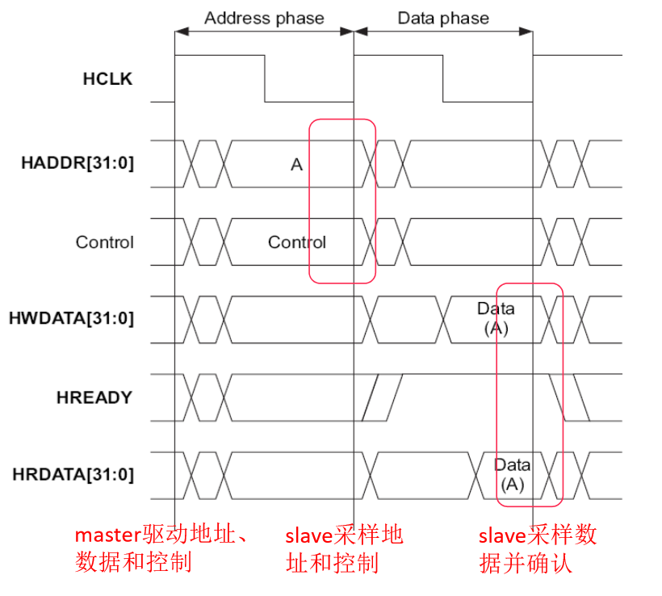

**有等待传输：HREADY 拉低，传输时间为2 + 最大等待周期**

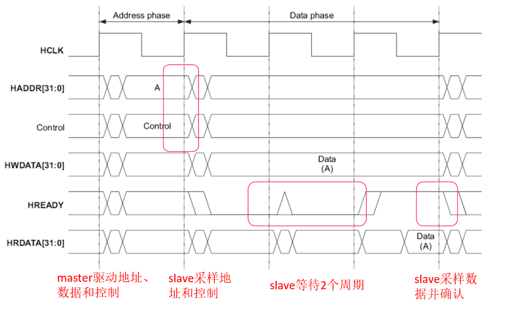

**连续传输：若数据流水线不断，单次 transfer 只需1个周期**

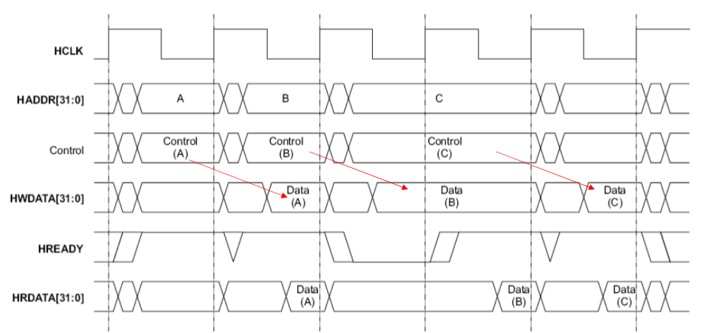

传输类型
^^^^^^^^^^
突发（burst）由多个 transfer 组成，表明 master 要发送多个数据。

AHB 使用信号 HTRANS[1:0] 区分不同的传输类型

===========  ========  =========================================
HTRANS[1:0]  传输类型                    描述
===========  ========  =========================================
00           IDLE      无数据传输
01           BUSY      master 处于忙碌状态，类似 slave 的 HREADY 信号
10           NONSEQ    1次普通传输或是长度为1的突发传输
11           SEQ       burst 传输状态
===========  ========  =========================================

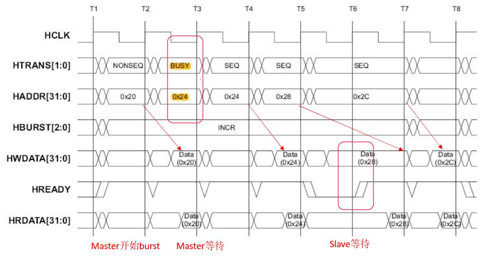

**T2：**  master 发送 burst 读，第一拍地址（0x20），传输为 NONSEQS。

**T3：**  master发出一个 BUSY 状态，表示本次发送的控制信息无效；此时 slave 返回上一拍对应的读数
据 Data(0x20)。

**T4：**  master发送第二拍 burst 地址（0x24），传输为 SEQ；此时因上一拍 master 发送的为 BUSY 传
输，这拍 master 会忽略 slave 的返回值。

**T5：**  master 继续发送第三拍的地址（0x28），slave 返回第二拍数据 Data(0x24)；

**T6：**  master 继续发送最后一拍的地址（0x2c），此时 salve 无法处理 master 传输，因此通过拉
低 hready 来进入等待状态。

**T7：**  因上一个 cycle 中 slave 拉低了 hready，master 需要保持对应的地址段信息；slave 此时可
以响应 master，因此把 hready 拉高表示此次传输有效，把对应的第三拍的数据 Data(0x28) 返回。

**T8：**  master 不会发送控制信息，slave 返回最后一拍的数据 Data(0x2C)

.. warning:: 无论是普通传输还是突发传输，传输的地址阶段时，类型都必须是 ``NONSEQS``。

锁传输
^^^^^^^^^
锁传输（Lock transfers）传输时 HMASTERLOCK 以保证当前传输能一次性传完。

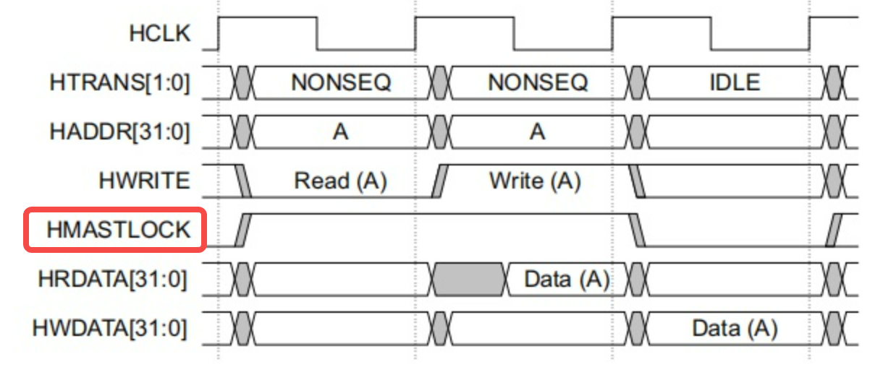

提前终止突发
^^^^^^^^^^^^^^
若当前 master 突发传输并未结束且未设置 LOCK，如果出现优先级更高的访问请求，
当前突发将提前终止，等到高优先级突发完成时再恢复传输。

- slave 在突发传输时 HTRANS 都是 SEQ 或 BUSY，若传输出现 IDLE，说明当前
  突发结束；若出现 NONSEQ，说明新的传输开始。
- 失去总线控制权的 master 将在重新得到控制权时完成先前传输，后续传输
  将以未定义长度的突发完成。

信号功能
----------

HBURST
^^^^^^^^^

===========  ====== ========================
HBURST[2:0]  类型             描述
===========  ====== ========================
000          SINGE  单次transfer
001          INCR   不限长递增突发
010          WRAP4  4-beat回环突发
011          INCR4  4-beat递增突发
100          WRAP8  8-beat回环突发
101          INCR8  8-beat递增突发
110          WRAP16 16-beat回环突发
111          INCR16 16-beat递增突发
===========  ====== ========================

递增突发（incrementing burst）
  访问连续的地址空间，每次 transfer 地址在先前地址基础上加上步长。

回环突发（wrapping burst）
  与递增突发相似，但若开始地址未与传输总量（size乘beat）对齐，传输地址将回到地址边界。

如：size 为4-Bytes，burst 长度为4，回环在16-Bytes边界上（即地址低4位应为0），
若开始地址为0x38（0011_1000，低4位不为0，受限于回环边界），后续地址为0x3C，0x30和0x34。

**4-beat 回环突发**

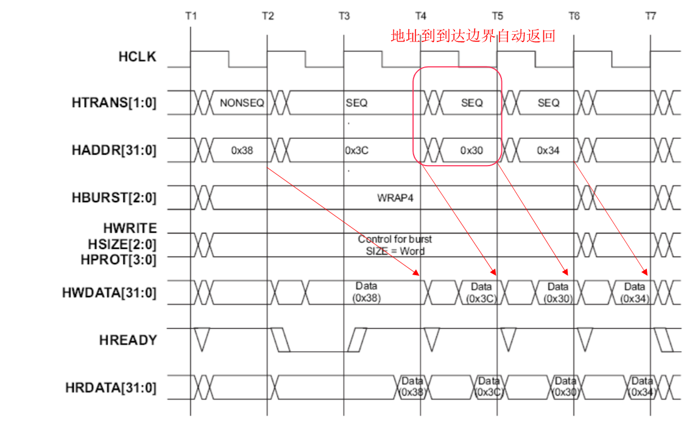

**4-beat 递增突发**

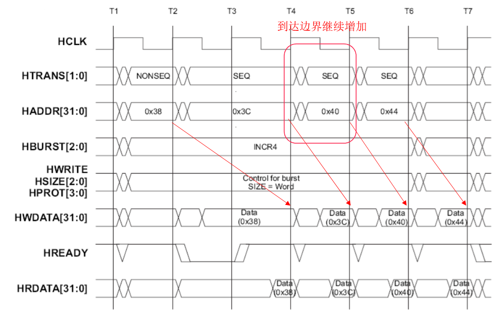

HSIZE
^^^^^^^
表示数据总线单个transfer的有效数据宽度。

==========  =========  ====
HSIZE[2:0]  数据宽度   描述
==========  =========  ====
000         8-bits     字节
001         16-bits    半字
010         32-bits    字
011         64-bits    双字
100         128-bits   4字
101         256-bits   8字
110         512-bits   16字
111         1024-bits  32字
==========  =========  ====

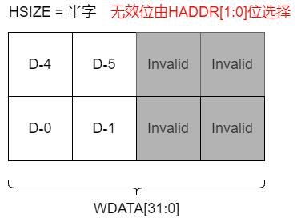

HPROT
^^^^^^^^^^
提供总线额外的访问信息和意图，起到一定的保护作用。

=========  ==========  =========  ===========  ==========
HPORT[3]    HPORT[3]   HPORT[3]    HPORT[3]       描述
---------  ----------  ---------  -----------  ----------
cacheable  bufferable  privilege  data/opcode
=========  ==========  =========  ===========  ==========
\-         \-          \-         0            操作码获取
\-         \-          \-         1            数据访问
\-         \-          0          \-           用户访问
\-         \-          1          \-           特权访问
\-         0           \-         \-           不可buffer
\-         1           \-         \-           可buffer
0          \-          \-         \-           不可cache
1          \-          \-         \-           可cache
=========  ==========  =========  ===========  ==========

HSELx
^^^^^^^^^^
地址译码器为总线上每个 slave 提供选题信号 HSELx，HSELx 通过组合
逻辑对地址译码产生。

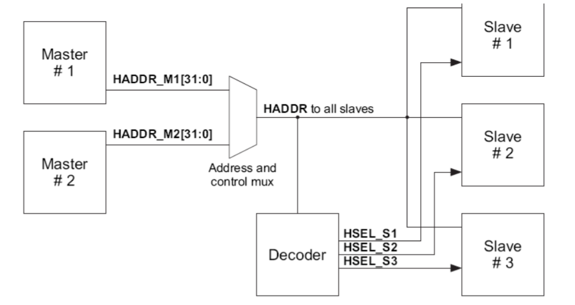

.. warning:: 每个 slave 最小地址空间为1KB，所有 master 的 burst 传输上限也是1KB，此举确保访问不会出现地址越界问题。

HRESP
^^^^^^^^^
master 发起一笔传输后，slave 必须通过 HRESP[1:0] 对传输回应，
slave 可以延迟一定数量的周期，建议最大等待时间不超过16个周期
以免总线锁死。

==========  =====  ====================================================
HRESP[1:0]  类型                           说明
==========  =====  ====================================================
00          OKAY   传输正确
01          ERROR  传输含有错误，需要两个周期
10          RETRY  传输未完成，需要两个周期
11          SPLIT  传输未完成，master下次接入时再完成传输，需要两个周期
==========  =====  ====================================================

.. warning:: 除 OKAY 外，所有响应都需要2个周期，确保 master 有充足的时间将总线驱动到 IDLE。

**RETRY 回应**

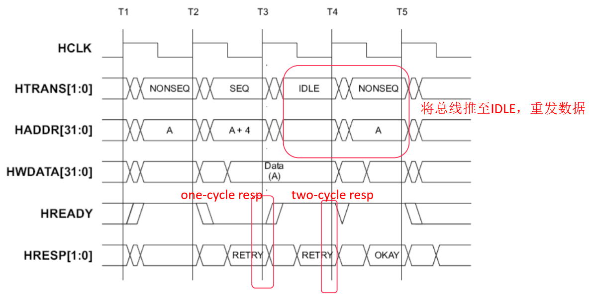

**ERROR 回应**

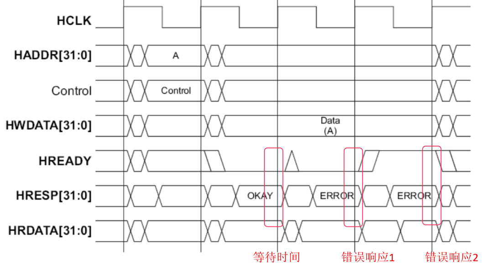

