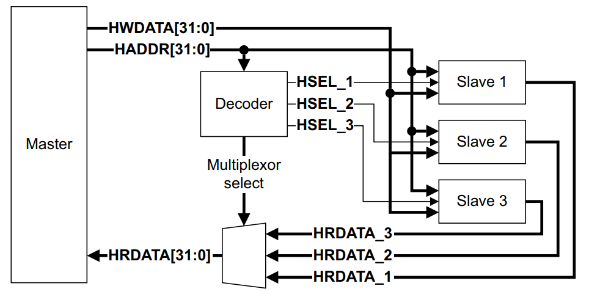
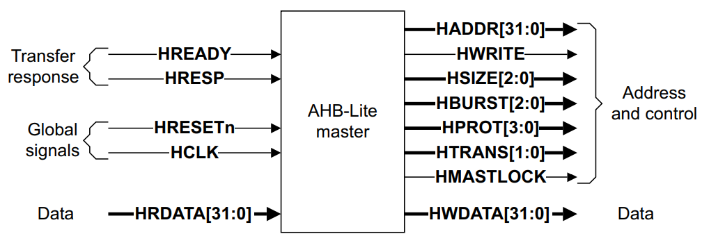
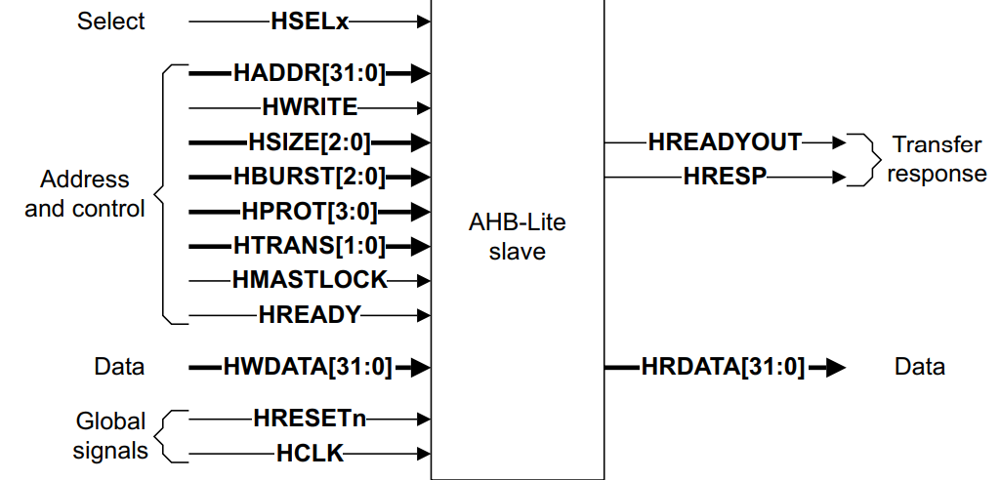
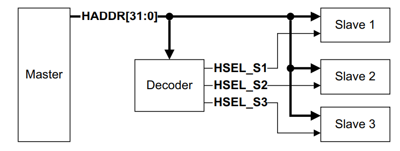
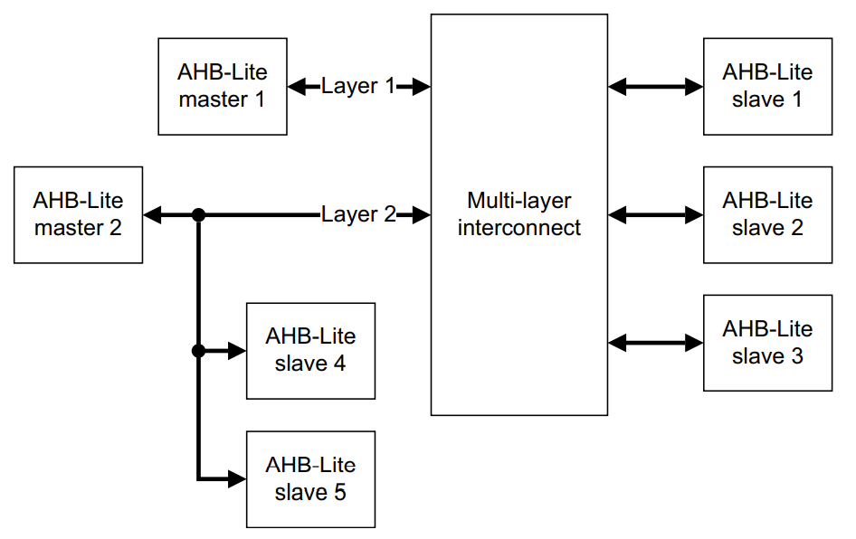

AHB-Lite 总线
====================
AHB-Lite 是 AHB 的简化版本，针对单 Master 设计的高频、
高性能总线。

总线特点：
  - 突发传输
  - 无需仲裁

**AHB-Lite总线结构**

.. note:: 除以下描述，其余功能均与 AHB 相同，详见 :doc:`ahb` 

AHB-Lite 组件
------------------
AHB-Lite 减少了 AHB 总线的接口数目，保留的接口功能与 AHB 总线相同，

**AHB-Lite master**

**AHB-Lite slave**

**AHB-Lite decoder**

.. note:: 最小地址空间为1KB，单词访问不能超过1KB边界。

**AHB-Lite mux**
slave 返回给 master 的数据都需 mux 选择通路。

.. note:: 最小地址空间为1KB，单词访问不能超过1KB边界。

多层 AHB-Lite
-----------------
由于 AHB-Lite 是单 master 系统，如果需要多 master，就得
采用多层 AHB-Lite 系统。多层 AHB-Lite 中 master 间需相互
隔离，每个 master 只能看到自己 AHB-Lite 层的设备。interconnect 
将连接共用的 slave 并完成仲裁。

