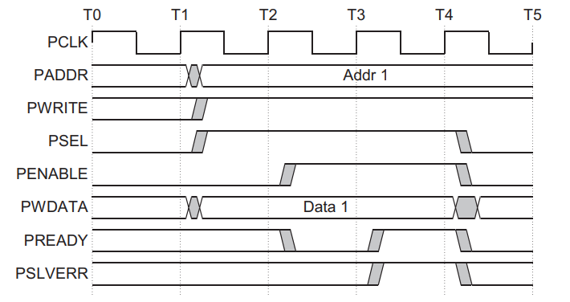

APB 总线
==========
APB (Advanced Peripheral Bus) 作为高级外设总线是 AMBA 协议之一，
也是最基本的总线协议。按照 ARM 官方定义，APB 是一种低成本的接口协议，
可以实现低功耗以及精简的接口设计，降低接口设计的复杂度。APB 协
议不支持流水线设计，主要应用在低带宽设计。

总线特点
  - 单次 transfer 至少2个周期，适用低速低带宽外设
  - 实现简单
  - 可挂在 AXI，AHB 接口，作为外设总线使用

APB 版本
---------

====  ===========================================================================
版本                                     差别
====  ===========================================================================
APB2  初版，定义 APB 基本的传输过程
APB3  - 增加信号 PREADY，实现等待传输
      - 增加信号 PSLVERR，实现 slave 错误上报机制
APB4  - 增加信号 PPROT，区分安全/非安全访问
      - 增加信号 PSTRB，写入数据支持部分数据选定
====  ===========================================================================

APB 接口
----------

=======  ======  ====================================================
信号名     源                            功能
=======  ======  ====================================================
PCLK     clock   全局时钟，上升沿有效
PRESETn  reset   全局复位，低电平有效
PADDR    bridge  地址信号
PPROT    bridge  保护信号，反映数据的安全程度
PSELx    bridge  片选，由 bridge 产生并连接所有设备，反映当前设备被选中
PENABLE  bridge  使能，反映从第二个周期后，都是 apb 传输
PWRITE   bridge  方向，高为写，低为读
PWDATA   bridge  写入数据
PSTRB    bridge  写探针，反映当前 PWDATA 哪些字节有效
PREADY   slave   准备信号，slave 能够接受访问
PRDATA   slave   读出数据
PSLVERR  slave   反映传输失败，不要求必须支持
=======  ======  ====================================================

.. note:: APB 有独立的读写接口，且共用握手信号 PREADY，因此，读写不能同时发生。

工作过程
-----------
写传输
^^^^^^^^^
**无等待的写传输**

**T2**  PSEL拉高，slave 接收 PADDR，PWDATA，PWRITE，写传输建立。

**T3**  PREADY 拉高，传输完成。

传输结束后，PSEL，PENABLE，PREADY拉低。

**有等待的写传输**

若 PSEL 拉高后，slave 无法接受访问，slave 可在 T3 PENABLE 拉高前
主动拉低主动拉低 PREADY 信号，待 slave 能够接收后，再拉高 PREADY 完
成传输。

**写探针**

写探针（PSTRB）信号用来指定 PWDATA 哪些字节段有效。PSTRB 中每1-bit 
对应 PWDATA 的1-Byte，PSTRB 为高时，对应 PWDATA 的字节有效。

.. note:: 用于实现数据宽度小于总线宽度的写访问

读传输
^^^^^^^^^
读传输和写传输过程相似，区别在于 PWRITE 信号在传输过程中为低。

**有等待的写传输**

.. note:: apb 读需要2个周期，第一周期 slave 确认地址，第二周期返回读出数据；而写操作理论上只需一个周期，之所以设计为2周期，是为了确保 **读写过程的一致性**。

**无等待的写传输**

信号功能
-----------

PSLVERR
^^^^^^^^^^

slave 能在读写访问中拉高 PSLVERR 来表明当前传输错误。只在 
APB 最后一个周期时拉高，建议不使用时保持拉低。

**写错误：表示所写地址可能没有更新**

**读错误：表示当前 PRDATA 无效**

PPROT
^^^^^^^
PPROT[2:0] 用于避免保护区域的非法访问。

=======  ==================================================
 信号                           功能
=======  ==================================================
PROT[0]  - 区分更高优先级特权模式
         - 0表示普通访问
         - 1表示特权访问
PROT[1]  - 区分安全空间
         - 0表示安全访问
         - 1表示非安全访问
PROT[2]  - 区分当前是指令或数据
         - 0表示数据访问
         - 1表示指令访问
=======  ==================================================

实现状态机
-----------

