AXI-Stream 总线
=================
AXI-Stream 是 AXI 协议的演化版本，具备 AXI 高性能、低延迟、可扩展的优点，
同时取消地址信号，简化控制方式，使得 AXI_Stream 更适合组件间大数据流的传输。

总线特点
    - 取消地址信号，用目的 ID 替代地址
    - 突发长度没有限制
    - 数据位宽为整数个字节（ AXI 需为2的幂次方）
    - 适合高速大数据应用，比如视频数据流
    - 不适合用作地址映射型设备

概念
-----

===============  ==============================================================================
  术语                                   说明
===============  ==============================================================================
Data byte           1个数据字节，数据有效
Position byte       1个位置字节，数据无效，仅反映数据位置信息
Null byte           1个空字节，既无数据，也无数据位置信息
Transfer            通过接口的一次数据传输，定义为 VALID 和 READY 信号的一次握手
Packet              包括单个或者多个 Transfer，类似 AXI4 的 burst
Frame               AXI4-Stream 中最高级别的数据组，一个 Frame 可以包含多个 Packet
Data                源和目的间传输的数据，可以是 transfer，packet
===============  ==============================================================================

数据流
^^^^^^^
数据流（data stream）有多种组成方式，本节介绍几种 AXI_Stream 可用的数据流形式。

字节流（Byte stream）
  由大量数据字节和空字节组成，所有的数据字节都将传送至目的节点。

空字节没有意义，能随意在数据流中插入/删除，在数据到达目的节点前需全部删除，
因此，下图的两个 packet 传输同样的数据。

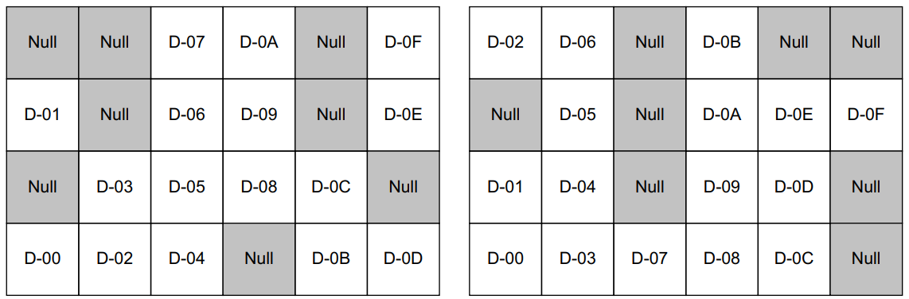

连续对齐流（Continuous aligned stream）
  由一连串对齐的数据字节组成，整个 packet 中没有位置字节和空字节。

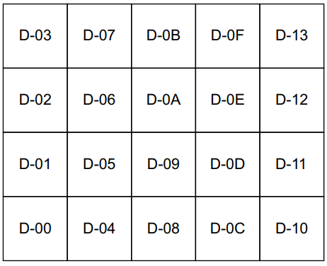

连续非对齐流（Continuous unaligned stream）
  由一连串数据字节组成，除了首尾能有位置字节外，整个 packet 不含位置字节。

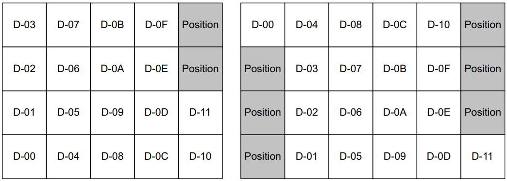

稀疏流（Sparse stream）
  由一连串数据字节和位置字节组成，所有的数据字节和位置字节都将传递至目的节点。
  
数据字节和位置字节数量任意，通常数据字节占多数。

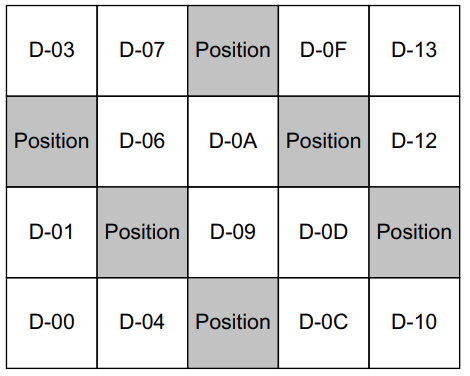

拓扑连接
^^^^^^^^

接口
-----

===============  ======  ============================================================================
    接口名         源                                        描述
===============  ======  ============================================================================
ACLK             Clock   全局时钟，上升沿采样
ARESETn          Reset   全局复位，低电位有效
TREADY           Slave   握手信号，表明 slave 能接收数据
TVALID           Master  握手信号，表明 master 将传递数据
TDATA[(8n-1):0]  Master  传递的数据
TSTRB[(n-1):0]   Master  字节限制符，表明 TDATA 对应字节是数据字节或位置字节
TKEEP[(n-1):0]   Master  字节限制符，表明 TDATA 对应字节是否为空字节
TLAST            Master  表明当前 packet 结束
TID[(i-1):0]     Master  数据流标识符，区分数据来源
TDEST[(d-1):0]   Master  提供数据流路由信息
TUSER[(u-1):0]   Master  用户定义的额外信息，随数据流一起传输
===============  ======  ============================================================================

.. note:: 
  n：是任意正整数

  i：推荐最大值 8-bit

  d:推荐最大值为 4-bit

  u:推荐值为 n 字节数的整数倍

TKEEP 和 TSTRB
^^^^^^^^^^^^^^^^^
信号 TKEEP 和 TSTRB 用于说明数据的字节类型，每一 bit 对应 TDATA[(8n+7):8n] 一个字节。

=====  =====  ==============  ==========================================================
TKEEP  TSTRB    类型            描述
=====  =====  ==============  ==========================================================
HIGH   HIGH   Data byte         关联字节是数据字节，数据有效，必须传递到目的
HIGH   LOW    Position byte     关联字节是位置字节，数据无效，数据位置有效，必须传递到目的
LOW    LOW    Null byte         关联字节是空字节，数据和位置均无效，不能传递到目的
LOW    HIGH   Reserved          一定不能出现
=====  =====  ==============  ==========================================================

interconnect 允许插入/删除数据流中的空字节，需插入场景：拓宽数据总线（数据宽度小于总线宽度）。

.. warning:: 
  master/slave不要求支持空字节，若interconnect能插入空字节，需要在数据流到达目的前删除他们。

TLAST
^^^^^^
TLAST 是 packet 边界的标识：
  - 当无效时，TLAST 表明后续还有别的 transfer，因此，当前 transfer 能接收 delay 来实现 upsizing，downsizing合并。
  - 当有效时，TLAST 表明当前 packet 结束。
  - 当有效时，TLAST 表明当前点适合对使用路径进行仲裁。（不强制，但这样做能提升效率）

协议中未定义 packet 的开始信号，开始信号可以由以下确定：
  - 复位后首次出现一对 TID 和 TDEST
  - 上个 packet 结束后，任意 TID 和 TDEST 的第一个 transfer

TLAST = ``1`` 时，transfer 可以为空字节，使用场景为：
  - 表明 packet 结束
  - 把缓存区中的所有数据 push
  - 完成 packet 结束产生 TLAST 对应的操作

.. note:: 
  只要上一个 transfer 的 TLAST=0 且 TID/TDEST 相等，当前 TLAST=1 且为空字节的 trnsfer 可与上一个 transfer 合并。

TUSER
^^^^^^
用途：
  - 特定数据的类型/位置标记
  - 提供辅助信号，如奇偶校验，控制信号和标志
  - 识别paket片段

TKEEP = ``0`` 时，TUSER 应置为无效。

协议推荐 TUSER 是 TDATA 位宽的整数倍，每个字节的用户信息打包在 TUSER 中；TUSER 也能传递整个 transfer 的相关信息。

TUSER 的填充（padding）和裁剪（trimming）用于用于 TUSER 接口宽度不匹配的场景，填充时，所有额外的 bits 都需要置 ``0``。

1-bit 映射 2-bit 填充
************************
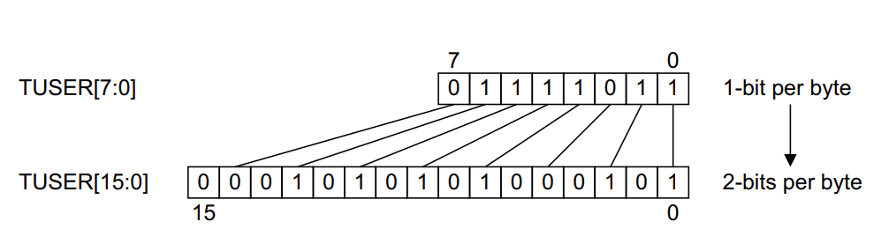

2-bit 映射 1-bit 裁剪
************************
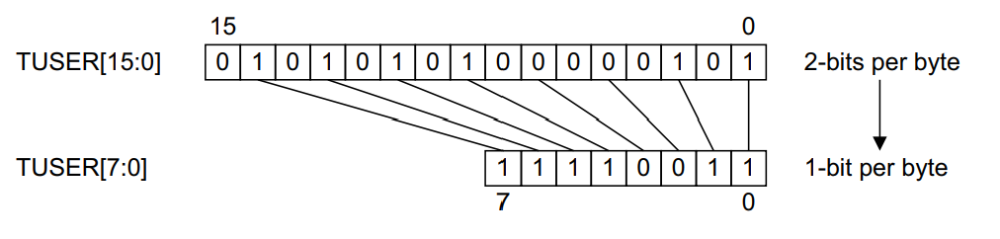

2-bit 映射 4-bit 填充
************************
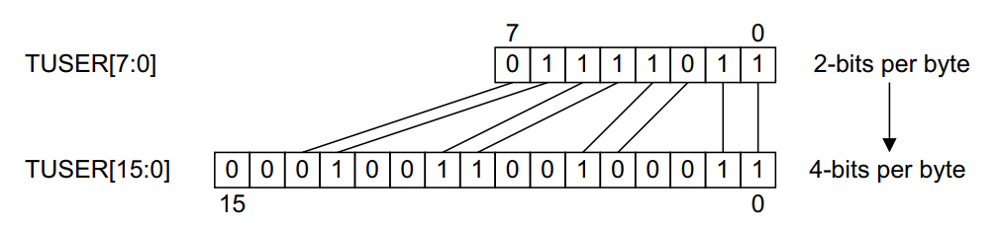

2-bit 映射 3-bit 填充
*************************
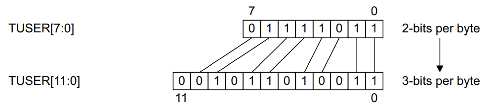

工作过程
---------

握手
^^^^^
TVALID 和 TREADY 握手表明数据已通过接口，用于 master/slave 控制数据速率。
  - master 拉高 TVALID 不能依赖 TREADY 的状态，一旦拉高就必须等待握手发生。
  - slave 允许等待 TVALID 生效后再拉高，在 TVALID 拉高前，slave 也能让拉高的 TREADY 拉低

master 先准备好发送（TVALID 拉高），slave 后准备好接收（TREADY 拉高），箭头处握手

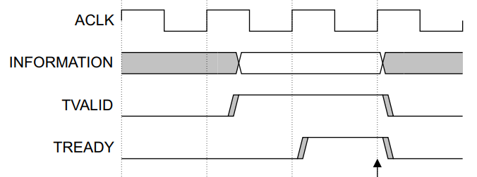

slave 先准备好接收（TREADY 拉高），master 后准备好发送（TVALID 拉高），箭头处握手

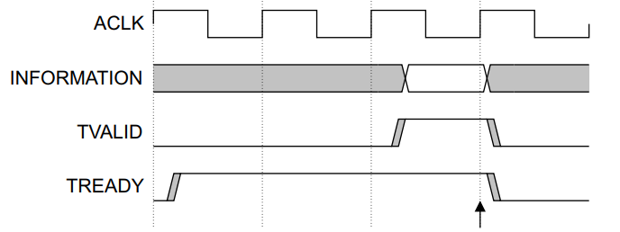

master/slave 同时准备好发送/接收，箭头处握手

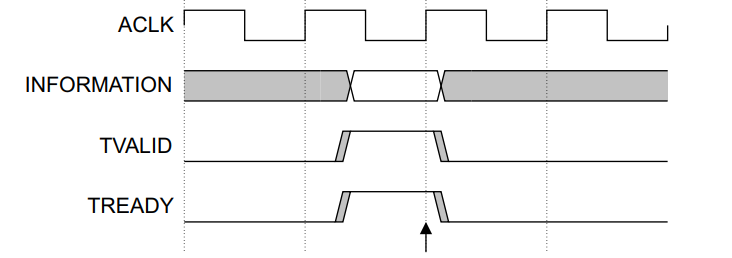

读/写访问
^^^^^^^^^
由于 AXI_Stream 删除地址线，传输过程不涉及读写概念，数据由源流向目的。

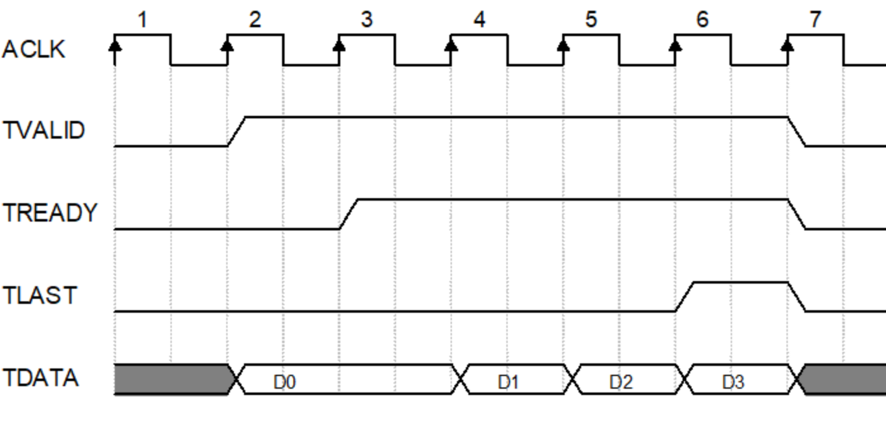

交织传输（transfer interleaving）
^^^^^^^^^^^^^^^^^^^^^^^^^^^^^^^^^^^^^^
将不同数据流的 transfer 交错传递。在某些拓扑互连中，交织传输可能受限于 TLAST，可通过合并的方式改善效率。

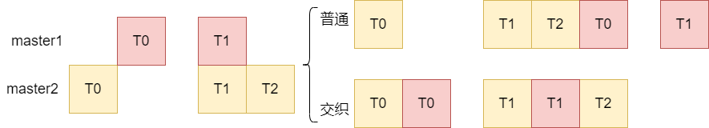

打包/合并
^^^^^^^^^^^
打包（packing）
  去除数据流中空字节的过程，通常与 upsizing，downsizing，合并一起使用。

合并（merge）
  将两个 transfer 合并到一个 transfer 的过程。

发生条件

  - transfer 含有空字节
  
规则

  - 两个 transfer 的 TID/TDEST 相同
  - TLAST = 0
  - 合并前后数据字节和位置字节的顺序必须不变
  - TLAST，TSTRB，TUSER的与字节的关联性必须正确

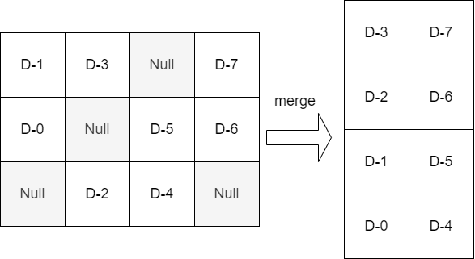

.. warning:: 
  相同 ID 不同 packet 间的 transfer 不能合并。如图，D1 与 D2 属于不同 packet（TLAST 在 D1 拉高），因此不能合并。

  .. image:: img/axi4stream/cant_merge.png
    :width: 400px

位宽转换
^^^^^^^^^^^

位宽裁剪（downsizing）
  将数据转换到小于数据位宽的总线上，此过程将单个 transfer 转化为多个 transfer。

位宽拓展（upsizing）
  将数据转换到大于数据位宽的总线上，此过程与合并相结合，使多个 transfer 转成单个 transfer。

规则

- 转换前后的数据流顺序不能变
- TSTRB 必须以相同的方式转换，对应字节的关系保持一致
- TLAST 关系必须一致
- 所转换 transfer 的 TID/TDEST 相同
- TUSER 的对应关系保持一致

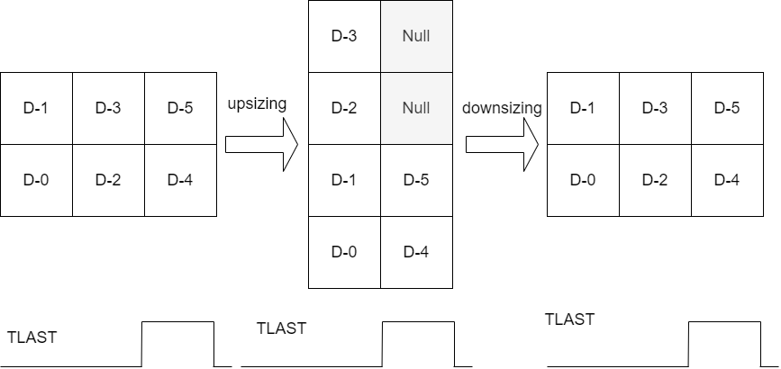

默认信号要求
--------------
AXI4-Stream 的接口信号可根据需要自行删除，以下是可删除信号与其代价。

==========  ======  =========================================================
可省略信号  默认值                            代价
==========  ======  =========================================================
TREADY      HIGH    不能反压（back-pressure）
TKEEP       HIGH    无法插入空字节，upsizing 受影响
TSTRB       HIGH    无法插入位置字节，非对齐访问受影响
TLAST       \-       LOW：无法仲裁，影响交织传输；HIGH：给仲裁带来不必要的阻塞
TID         LOW     单 master 时不需要
TDEST       LOW     单 slave 时不需要
TUSER       LOW     \-
TDATA       \-       允许不使用 TDATA，若没有 TDATA，TSTRB 也应没有
==========  ======  =========================================================

兼容性：
  - 直连设备的兼容性，需考虑主从设备直连接口是否兼容
  - interconnect 兼容性，需考虑 interconnect 的实现是否和主从接口兼容

总结
-----

AXI4-Stream 接口与 AXI4 写通道的差别
^^^^^^^^^^^^^^^^^^^^^^^^^^^^^^^^^^^^^^
- AXI4 写通道不允许交织（没有 WID）
- AXI4—Stream 对 burst/packet 的长度不做限制
- AXI4—Stream 允许数据位宽是任意整数个字节
- AXI4—Stream 包含 TID 和 TDEST 信号，能够区分源和目的
- AXI4—Stream 对 TUSER 信号的定义更加精确
- AXI4—Stream 包含 TKEEP 信号，允许插入空字节

疑问
^^^^^^^^^^^^

1. AXI4—Stream 的 Frame 是什么？
2. AXI4—Stream 协议原文强调所有 transfer 顺序不能调，怎么理解交织传输？
  
::

  "The AXI4-Stream protocol requires that all transfers remain ordered. 
  It does not permit the reordering of transfers."