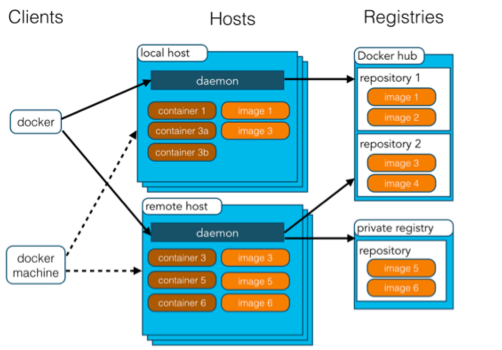

Docker 
=================
Docker 是一个开源的应用容器引擎，基于 Go 语言 并遵从 Apache2.0 协议开源。

Docker 可以让开发者打包他们的应用以及依赖包到一个轻量级、可移植的容器中，然后发布到任何流行的 Linux 机器上，也可以实现虚拟化。

容器是完全使用沙箱机制，相互之间不会有任何接口（类似 iPhone 的 app）,更重要的是容器性能开销极低。

Docker 从 17.03 版本之后分为 CE（Community Edition: 社区版） 和 EE（Enterprise Edition: 企业版）。

概述
------
应用场景
    - Web 应用的自动化打包和发布。
    - 自动化测试和持续集成、发布。
    - 在服务型环境中部署和调整数据库或其他的后台应用。
    - 从头编译或者扩展现有的 OpenShift 或 Cloud Foundry 平台来搭建自己的 PaaS 环境。

优点
    - 快速，一致地交付您的应用程序。
    - 响应式部署和扩展。
    - 在同一硬件上运行更多工作负载。

架构
-----
Docker 包括三个基本概念:

镜像（Image）
    Docker 镜像（Image），就相当于是一个 root 文件系统。比如官方镜像 ubuntu:16.04 就包含了完整的一套 Ubuntu16.04 最小系统的 root 文件系统。

容器（Container）
    镜像（Image）和容器（Container）的关系，就像是面向对象程序设计中的类和实例一样，镜像是静态的定义，容器是镜像运行时的实体。容器可以被创建、启动、停止、删除、暂停等。

仓库（Repository）
    仓库可看成一个代码控制中心，用来保存镜像。

Docker 使用客户端-服务器 (C/S) 架构模式，使用远程API来管理和创建Docker容器。

命令
------

========================================================== ==========================================
容器/镜像命令                                                   描述
========================================================== ==========================================
``docker image ls``                                         列出本机的所有 image 文件
``docker image rm [imageName]``                             删除 image 文件
``docker container ls -l``                                  列出本机正在运行的容器
``docker container ls -l --all``                            列出本机所有容器，包括终止运行的容器
``docker container rm [containerID]``                       删除容器文件
``docker export [OPTIONS] CONTAINER``                       导出容器
``docker import [OPTIONS] file|URL| [REPOSITORY[:TAG]]``    导入容器
========================================================== ==========================================

容器启动 ``docker run [OPTIONS] IMAGE [COMMAND] [ARG...]``

如 ``docker run -it -p 8088:8088 -p 8089:8089 -p 8090:9090 -v /root/soft/docker:/root/soft/docker -v /root/soft/dockertt:/root/soft/dockertt loen/rc /bin/bash``

docker run [OPTIONS] IMAGE [COMMAND] [ARG...]

========================================================== ==========================================
run选项                                                      描述
========================================================== ==========================================
-a, --attach=[]                                             登录容器（以docker run -d启动的容器）
-c, --cpu-shares=0                                          设置容器CPU权重，在CPU共享场景使用
--cap-add=[]                                                添加权限
--cap-drop=[]                                               删除权限
--cidfile=""                                                运行容器后，在指定文件中写入容器PID值，一种典型的监控系统用法
--cpuset=""                                                 设置容器可以使用哪些CPU，此参数可以用来容器独占CPU
-d, --detach=false                                          指定容器运行于前台还是后台
--device=[]                                                 添加主机设备给容器，相当于设备直通
--dns=[]                                                    指定容器的dns服务器
--dns-search=[]                                             指定容器的dns搜索域名，写入到容器的/etc/resolv.conf文件
-e, --env=[]                                                指定环境变量，容器中可以使用该环境变量
--entrypoint=""                                             覆盖image的入口点
--env-file=[]                                               指定环境变量文件，文件格式为每行一个环境变量
--expose=[]                                                 指定容器暴露的端口，即修改镜像的暴露端口
-h, --hostname=""                                           指定容器的主机名
-i, --interactive=false                                     打开STDIN，用于控制台交互
--link=[]                                                   指定容器间的关联，使用其他容器的IP、env等信息
--lxc-conf=[]                                               指定容器的配置文件，只有在指定--exec-driver=lxc时使用
-m, --memory=""                                             指定容器的内存上限
--name=""                                                   指定容器名字，后续可以通过名字进行容器管理，links特性需要使用名字
--net="bridge"                                              容器网络设置
-P, --publish-all=false                                     指定容器暴露的端口
-p, --publish=[]                                            指定容器暴露的端口
--privileged=false                                          指定容器是否为特权容器，特权容器拥有所有的capabilities
--restart=""                                                指定容器停止后的重启策略
--rm=false                                                  指定容器停止后自动删除容器(不支持以docker run -d启动的容器)
--sig-proxy=true                                            设置由代理接受并处理信号，但是SIGCHLD、SIGSTOP和SIGKILL不能被代理
-t, --tty=false                                             分配tty设备，该可以支持终端登录
-u, --user=""                                               指定容器的用户
-v, --volume=[]                                             给容器挂载存储卷，挂载到容器的某个目录
--volumes-from=[]                                           给容器挂载其他容器上的卷，挂载到容器的某个目录
-w, --workdir=""                                            指定容器的工作目录
========================================================== ==========================================

================================= ==========================================
常用命令                            描述
================================= ==========================================
docker stop 容器ID                  关闭运行中的容器
docker start 容器ID                 启动一个已经停止的容器
docker restart 容器ID               重启一个容器
docker attach 容器ID                进入一个运行中的容器
docker ps                           显示当前运行的容器
docker images                       查看本地镜像
docker rmi                          删除所有镜像
docker build -t 镜像名称 .           构建容器
docker rm 容器ID                    删除容器
docker history 镜像ID               查看历史
docker export 容器ID                导出容器
================================= ==========================================

Docker换源
----------------------
::

    sudo mkdir -p /etc/docker
    sudo tee /etc/docker/daemon.json <<-'EOF'
    {
    "registry-mirrors": ["https://yxzrazem.mirror.aliyuncs.com"]
    }
    EOF
    sudo systemctl daemon-reload
    sudo systemctl restart docker

